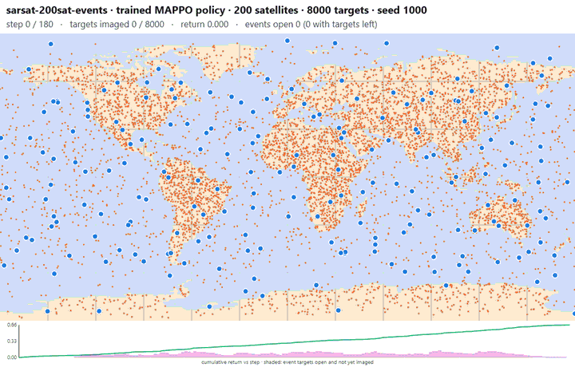
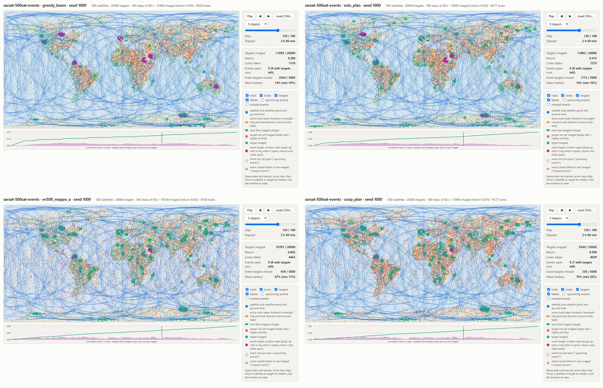

# SarSat

A fast multi-agent reinforcement-learning environment in JAX. Agents are satellites in
low Earth orbit that cooperate to image ground targets. It follows the
[Jumanji](https://github.com/instadeepai/jumanji) API and trains with
[MAPX](https://github.com/Chulabhaya/mapx) through `mapx_integration/`.



*A trained MAPPO policy on `sarsat-200sat-events`: 200 satellites (blue), 8000 targets
(orange, green once imaged), event clusters that pop up for a few minutes (magenta).
Rendered with the built-in viewer.*

## 1. Install

```bash
git clone git@github.com:gcastanon/sarsat.git && cd sarsat
pip install -e ".[dev]"
pytest -q
```

Python 3.10+. The environment alone runs anywhere. Training needs a CUDA JAX, which
means Linux or WSL2, plus a MAPX checkout: see
[mapx_integration/README.md](mapx_integration/README.md) (its Setup section, five minutes).

## 2. What it simulates

| | |
|---|---|
| Agents | 1-1000 satellites on circular orbits at 550 km; they never manoeuvre |
| Step | 60 s of simulated time; 180 steps (3 h) per episode by default |
| Action | `[incidence, squint, side, sense]`: two continuous slots in `[-1, 1]`, two binary switches |
| Sensor | side-looking SAR: incidence 20-45 degrees, squint +-25 degrees, nadir hole, 4 x 4 degree beam |
| Battery | sensing costs 10% per step, 2% recharges every step: a 20% sustainable duty cycle |
| Targets | fixed lat/lon points, 80% on land; optional high-value hotspots and time-windowed events |
| Reward | shared: the priority of every target newly caught in a beam; each target pays once |
| Observation | egocentric. `SarSat`: tracks of accessible targets, nearest neighbours, own battery. `CoopSarSat` (used for training): ranked candidate beams with value and contention, a cluster look-ahead, own battery |
| Return | fraction of total target priority imaged, in `[0, 1]` |

The benchmark scenario used below, `sarsat-100sat-hotspots`:

| Parameter | Value |
|---|---|
| Satellites | 100 in 10 Walker planes |
| Targets | 6000 background + 40 hotspots of 50 targets, hotspot priority x10 |
| Why it needs cooperation | the battery binds and targets differ in value, so who spends charge on what matters: a planner that knows what teammates will cover beats the best independent policy by ~10% |

Two larger benchmarks build on it with time-windowed *events* (clusters that can only be
imaged for 10-30 steps, over a persistent background): `sarsat-200sat-events` (200
satellites, DECISIONS issue 24) and `sarsat-500sat-events` (500 satellites in 50 Walker
planes, 20,000 targets, 5% duty cycle, issue 26). Returns on seeds 1000-1015:

| Policy | Plans ahead | Cooperates | 100 hotspots | 200 events | 500 events |
|---|---|---|---|---|---|
| `greedy_beam` | no | no | 0.786 | 0.440 | 0.394 |
| `coop_dedup` (centralised, no target taken twice in a step) | no | yes | 0.789 | 0.453 | 0.432 |
| `solo_plan` (independent, plans its own future) | yes | no | 0.807 | 0.450 | 0.658 |
| Best MAPPO checkpoint | learned | learned | 0.898 | 0.649 | 0.868 |
| `coop_plan` (centralised planner) | yes | yes | 0.904 | 0.670 | 0.883 |

The MAPPO rows are `mappo_v5`, `ev_mappo_e` and `ev500_mappo_a` (the last trained on one
rented A40, 2.4 h, $1.19; issues 23, 25, 27). Each beats every independent and
non-planning reference on 16/16 seeds and reaches 97-99% of `coop_plan`, above it on 2
seeds at 100 satellites and none at 200 or 500. The 500-satellite benchmark is the one
where both axes pay: planning ahead is worth two thirds on its own, cooperating only a
tenth without planning but a third on top of it, each step up on every seed.



*Seed 1000, step 120 of 180. Top: `greedy_beam`, `solo_plan`; bottom: the trained MAPPO
policy, `coop_plan`. The independent policies have spent their batteries (14%) on
background targets when events open; the trained policy keeps 67% and misses a sixth as
many event targets.*

## 3. Train

IPPO on the 100-satellite hotspot scenario, from `mapx_integration/`:

```bash
cd mapx_integration
./launch.sh ippo ippo_v1 sarsat-100sat-hotspots
```

`launch.sh` bakes in the best recipe (slot-mixture action head, `credit_mix=0.5`,
32 environments x 180-step rollouts, 1500 updates) and logs to `~/marl/runs/ippo_v1/train.log`.
Watch it with `./watch_runs.sh ippo_v1`.

Expected: the evaluator's `Fraction imaged mean` passes the greedy reference (0.79) within
the first evaluations and settles at 0.89-0.91 by roughly update 300 (about two hours on
one RTX 5070 Ti). MAPX keeps the best checkpoint. On the paired test seeds 1000-1015:

| Policy | Return |
|---|---|
| Random | 0.07 |
| `greedy_beam` (best independent heuristic) | 0.79 |
| `coop_dedup` (centralised, same-step deduplication only) | 0.79 |
| **IPPO, this recipe** | **0.895** (beats `greedy_beam` on 16/16 seeds) |
| MAPPO, this recipe (`./launch.sh mappo ...`) | 0.898 |
| `coop_plan` (centralised planner, upper reference) | 0.90 |

## 4. Evaluate and view

Score the best checkpoint on the same seeds as the references above (CPU, so it can run
while a training holds the GPU):

```bash
JAX_PLATFORMS=cpu ./eval_runs.sh ippo ippo_v1
```

It prints a per-seed table against `greedy_beam` / `coop_plan` and writes
`~/marl/runs/ippo_v1/eval_seeds.json`. Then export one episode for the viewer:

```bash
cd .. && JAX_PLATFORMS=cpu python scripts/export_viewer_runs.py --run ~/marl/runs/ippo_v1 --system ippo
```

Open `runs/viewer/hotspots100-ippo_v1/episode.html` in a browser. Play, scrub, hover a
satellite or target. To compare against the references without training anything, drop
the four CSVs of any folder in [examples/](examples/README.md) onto `sarsat/viewer.html`.

## 5. Run it live

[sarsat-live](https://github.com/gcastanon/sarsat-live) runs the trained 500-satellite actor
continuously at 60x real time in a browser, with typed tasking requests ("image the port of
Rotterdam, high priority, within 20 minutes") turned into targets the agents collect within
30 minutes, all offline. It drives `sarsat.live.LiveWorld` (rolling episodes, here) from a
tagged sarsat release; DECISIONS issues 28 and 29.

## 6. Design notes

* [docs/index.html](docs/index.html): the codebase guide -- code map, core data structures and
  how experiments, training and evaluation work, with diagrams and links into the source.
  Open it in a browser from a checkout.
* [DECISIONS.md](DECISIONS.md): every non-obvious choice, issue by issue, with measurements.
* [IMPROVEMENTS.md](IMPROVEMENTS.md): what was deliberately left out.
* [mapx_integration/README.md](mapx_integration/README.md): the training recipe, all its
  options, and the WSL/GPU limits.
* Programmatic use of the environment:

```python
import jax
from sarsat import SarSat

env = SarSat(num_satellites=8, max_targets=100)
state, timestep = jax.jit(env.reset)(jax.random.PRNGKey(0))
state, timestep = jax.jit(env.step)(state, env.action_spec.generate_value())
```
