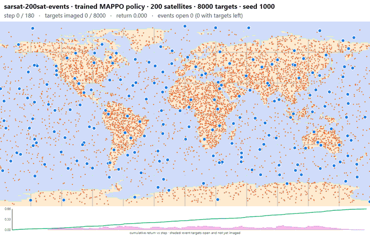
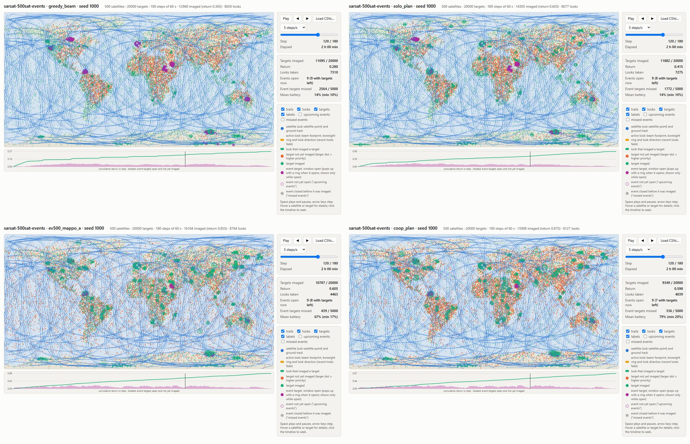

# SarSat

A fast multi-agent reinforcement-learning environment in JAX. The agents are satellites in
low Earth orbit that cooperate to image ground targets with side-looking radar (SAR). It
follows the [Jumanji](https://github.com/instadeepai/jumanji) API and trains with
[MAPX](https://github.com/Chulabhaya/mapx) through `mapx_integration/`.



*A trained MAPPO policy on `sarsat-200sat-events`: 200 satellites (blue), 8000 targets
(orange, green once imaged), and event clusters that can only be imaged for a few minutes
(magenta). Rendered with the built-in viewer.*

## Quick start

```bash
git clone git@github.com:gcastanon/sarsat.git && cd sarsat
pip install -e ".[dev]"
pytest -q
```

Python 3.10+. The environment runs on CPU anywhere; training needs a CUDA JAX (Linux,
WSL2 or a rented GPU) and a MAPX checkout, see [Train](#train).

```python
import jax
from sarsat import SarSat

env = SarSat(num_satellites=8, max_targets=100)
state, timestep = jax.jit(env.reset)(jax.random.PRNGKey(0))
state, timestep = jax.jit(env.step)(state, env.action_spec.generate_value())
print(timestep.reward)  # (8,): the shared team reward, one copy per satellite
```

Run a reference policy and open the result in the map viewer, no training needed:

```bash
python -m sarsat.evaluate --satellites 8 --targets 100 --policy greedy --out runs/eval
```

This writes four CSV logs and `runs/eval/episode.html`; open the HTML in a browser, press
play, scrub, hover a satellite or target.

## What it simulates

| | |
|---|---|
| Agents | 1-1000 satellites on circular orbits at 550 km; they never manoeuvre |
| Step | 60 s of simulated time; 180 steps (3 h) per episode by default |
| Action | `[incidence, squint, side, sense]`: two continuous values in `[-1, 1]` (where to point), two binary switches (look left or right, sense or not) |
| Sensor | incidence 20-45 degrees either side of the ground track, squint up to 25 degrees fore or aft, a 4 x 4 degree beam, nothing directly below (nadir hole) |
| Battery | sensing costs 10% per step and 2% recharges every step, so a satellite can sense about one step in five |
| Targets | fixed points, 80% on land; optionally high-value *hotspots* and time-windowed *events* |
| Reward | shared by the whole team: the priority of every target newly caught in a beam; each target pays once |
| Return | the fraction of total target priority imaged, in `[0, 1]` |
| Observation | egocentric. `SarSat`: the accessible targets, nearest neighbours, own battery. `CoopSarSat` (used for training): ranked candidate beams with their value and contention, a look-ahead over target clusters, own battery |

The battery is what makes this a cooperation problem: each satellite can image only a
fraction of what it sees, so which satellite spends its charge on which target matters.
[DECISIONS.md](DECISIONS.md) explains every modelling choice.

## Benchmarks and results

Four scenarios, each a Hydra config under
`mapx_integration/mapx/configs/env/scenario/`:

| Scenario | Satellites | Targets | Duty cycle | What makes it hard |
|---|---|---|---|---|
| `sarsat-100sat-hotspots` | 100 in 10 planes | 6000 background + 40 hotspots of 50, worth 10x each | 20% | deciding who spends battery on which hotspot |
| `sarsat-200sat-events` | 200 in 20 planes | 6000 background + 40 events of 50, each open for 10-30 steps | 10% | still having charge when an event only you can reach opens |
| `sarsat-500sat-events` | 500 in 50 planes | 15,000 background + 100 events of 50 | 5% | both of the above, at scale |
| `sarsat-500sat-announced` | 500 in 50 planes | as above, but every target has a window (events 10-30 steps, background 30-90), announced at a random time at least 30 minutes before it opens | 5% | planning around requests that are not known in advance |

Every policy is scored on the same 16 test seeds (1000-1015). The four reference policies
in `sarsat/reference.py` bracket what a learner can do:

| Policy | Plans ahead | Cooperates | 100 hotspots | 200 events | 500 events |
|---|---|---|---|---|---|
| Random | no | no | 0.07 | | |
| `greedy_beam`: each satellite takes its best beam now | no | no | 0.786 | 0.440 | 0.394 |
| `coop_dedup`: greedy, but no target taken twice in a step (centralised) | no | yes | 0.789 | 0.453 | 0.432 |
| `solo_plan`: each satellite plans its own future, ignoring the others | yes | no | 0.807 | 0.450 | 0.658 |
| **Trained MAPPO** (best checkpoint) | learned | learned | **0.898** | **0.649** | **0.868** |
| `coop_plan`: centralised planner that knows what every satellite will cover | yes | yes | 0.904 | 0.670 | 0.883 |

The trained policies are `mappo_v5`, `ev_mappo_e` and `ev500_mappo_a` (DECISIONS issues 23,
25 and 27). Each beats every non-cooperating or non-planning reference on all 16 seeds and
reaches 97-99% of the centralised planner, while acting only on what each satellite sees.
IPPO (no centralised critic) reaches 0.895 on the hotspot scenario.

No learner has been trained on `sarsat-500sat-announced` yet (DECISIONS issue 30). Its
references score `greedy_beam` 0.372, `coop_dedup` 0.397, `solo_plan` 0.645 and `coop_plan`
0.792; the last two are clairvoyant there, seeing every window at the reset, while a
learner observes nothing about a request before its announcement.

On the 500-satellite scenario the two skills compound. Planning alone (`solo_plan`) lifts
the greedy rule from 0.39 to 0.66; cooperation alone (`coop_dedup`) only to 0.43; together
(`coop_plan`) they reach 0.88.



*Seed 1000, step 120 of 180. Top: `greedy_beam`, `solo_plan`; bottom: trained MAPPO,
`coop_plan`. The independent policies have run their batteries down to 14% on background
targets by the time the events open; the trained policy has kept 67% and misses a sixth as
many event targets.*

## Train

Training runs from `mapx_integration/` on a CUDA machine with MAPX installed (setup in
[mapx_integration/README.md](mapx_integration/README.md), about five minutes):

```bash
cd mapx_integration
./launch.sh ippo ippo_v1 sarsat-100sat-hotspots
./watch_runs.sh ippo_v1
```

`launch.sh` bakes in the recipe behind the results above and logs to
`~/marl/runs/ippo_v1/train.log`. Expect the evaluator's `Fraction imaged mean` to pass
`greedy_beam` (0.79) within the first few evaluations and settle at 0.89-0.91 by about
update 300, roughly two hours on one RTX 5070 Ti. MAPX keeps the best checkpoint.

## Evaluate and view a trained policy

Score the best checkpoint on the test seeds (on the CPU, so it can run beside a training):

```bash
JAX_PLATFORMS=cpu ./eval_runs.sh ippo ippo_v1
```

This prints a per-seed table against the reference policies and writes
`~/marl/runs/ippo_v1/eval_seeds.json`. To watch one episode:

```bash
cd .. && JAX_PLATFORMS=cpu python scripts/export_viewer_runs.py --run ~/marl/runs/ippo_v1 --system ippo
```

then open `runs/viewer/hotspots100-ippo_v1/episode.html`. [examples/](examples/README.md)
holds ready-made episodes of the trained policies and the references: drop a folder's four
CSVs onto `sarsat/viewer.html`.

## Live demo

[sarsat-live](https://github.com/gcastanon/sarsat-live), a separate repository, runs the
trained 500-satellite policy forever at 60x real time in a browser. Typed requests such as
*"image the port of Rotterdam, high priority, within 20 minutes"* become targets the
satellites try to collect, parsed entirely offline. The world it runs,
`sarsat.live.LiveWorld` (rolling episodes), lives and is tested here; the demo pins a tagged
sarsat release (DECISIONS issues 28 and 29).

## Repository map

| Path | What it holds |
|---|---|
| `sarsat/` | the environment package: `env.py` (`SarSat`), `orbits.py`, `targets.py`, `coop.py` (`CoopSarSat`), `windows.py` (time-windowed events), `announce.py` (announced requests), `reference.py` (reference policies), `evaluate.py` (logs and viewer), `live.py` (rolling-episode world for the live demo) |
| `tests/` | the test suite (`pytest -q`) |
| `mapx_integration/` | training and evaluation with MAPX: launch scripts, wrappers, network, Hydra configs, Runpod run plans |
| `scripts/` | baselines, scenario sweeps, benchmarks, report and viewer export tools |
| `examples/` | recorded episodes for the viewer |
| `reports/` | the results deck and its data |
| `docs/` | the codebase guide and README media |

## Further reading

* [docs/index.html](docs/index.html): the codebase guide. Code map, core data structures,
  how an experiment, a training run and an evaluation fit together, with diagrams and
  links into the source. Open it in a browser from a checkout.
* [DECISIONS.md](DECISIONS.md): every non-obvious design choice and experiment, with
  measurements.
* [IMPROVEMENTS.md](IMPROVEMENTS.md): what was deliberately left out, and where it would
  plug in.
* [STATUS.md](STATUS.md): current state, open questions and the release process.
* [reports/sarsat_marl_results.html](reports/sarsat_marl_results.html): the results deck.
